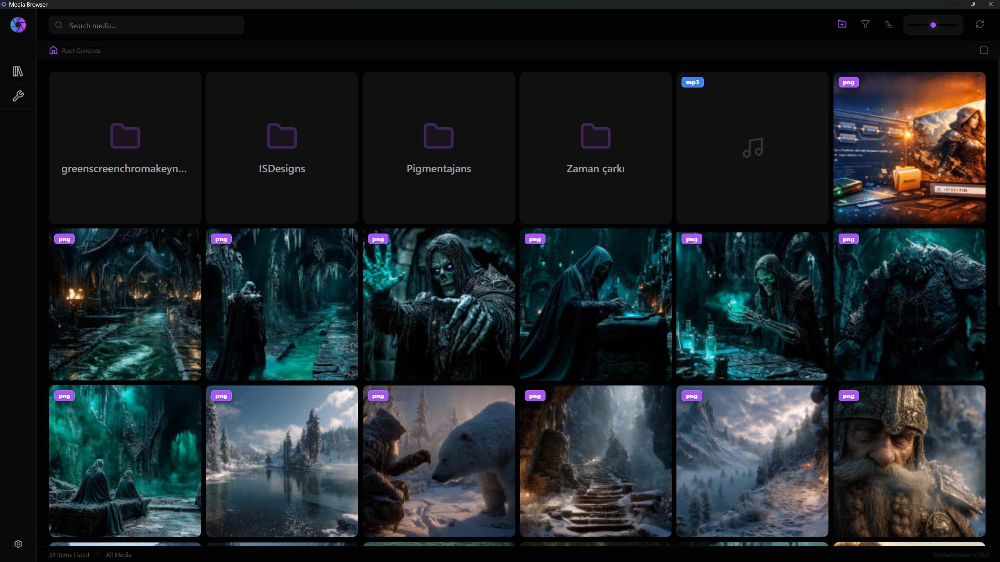
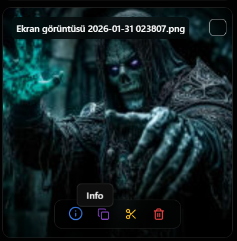
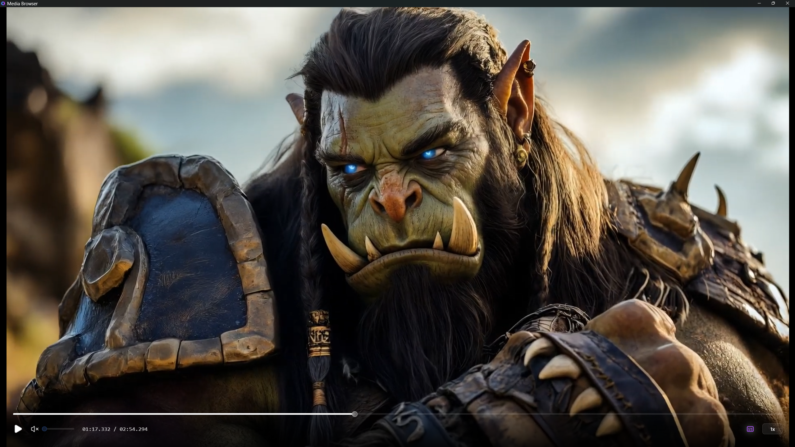
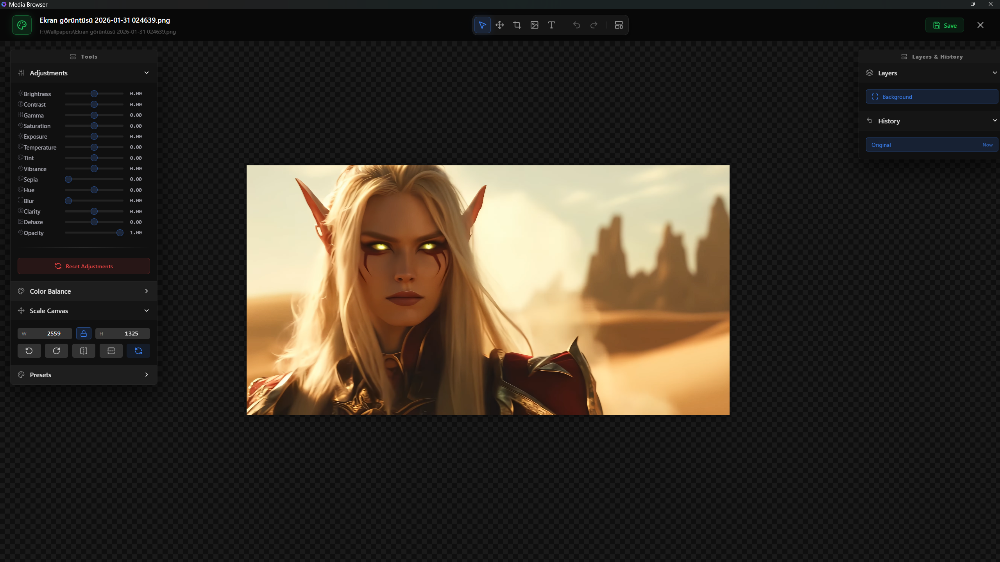
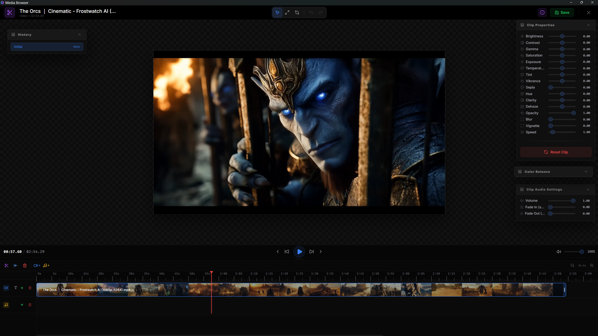
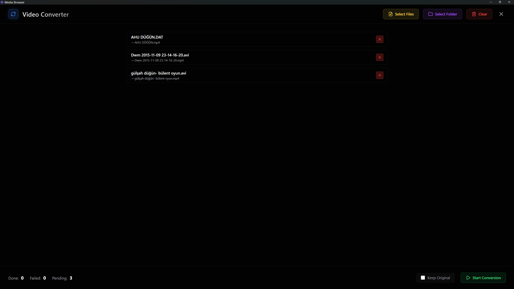
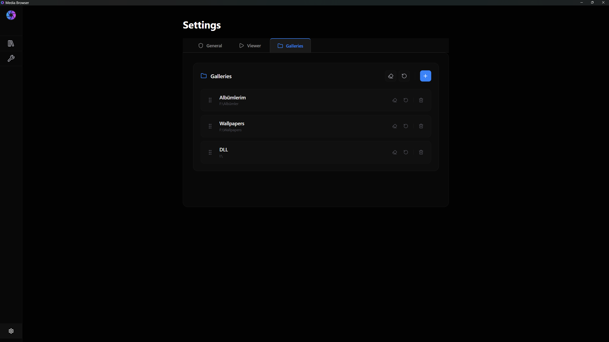
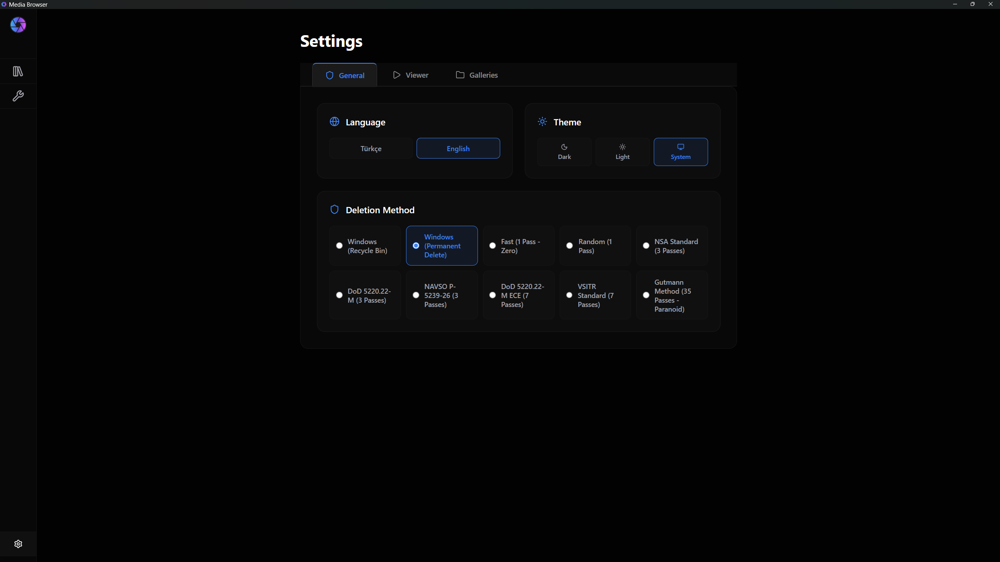

# MediaBrowser

MediaBrowser, yerel medya dosyalarınızı (resim, video, ses) yönetmek, düzenlemek ve oynatmak için geliştirilmiş, yüksek performanslı ve modern bir masaüstü uygulamasıdır. 

## 🤖 AI Destekli Geliştirme

Bu projenin **%90'ı**, **Antigravity** platformu üzerinde **Gemini 3.1 Flash/Pro** ve **Claude 4.5/4.6 Opus** yapay zeka modelleri tarafından, akıllı bir eş-programcı (pair-programmer) yaklaşımıyla geliştirilmiştir. Tasarımdan karmaşık Rust backend mantığına kadar projenin her aşamasında yapay zeka desteğinden yararlanılmıştır.

## 🛠️ Kullanılan Teknolojiler

*   **Backend:** [Rust](https://www.rust-lang.org/) (Hız ve güvenlik için)
*   **Web Framework:** [Tauri v2](https://v2.tauri.app/) (Hafif ve güvenli masaüstü altyapısı)
*   **Frontend:** [React 19](https://react.dev/) & [TypeScript](https://www.typescriptlang.org/)
*   **Database:** [SQLite](https://www.sqlite.org/) (sqlx ile metadata ve not yönetimi)
*   **Medya İşleme:** [FFmpeg](https://ffmpeg.org/) (Thumbnail üretimi, video düzenleme ve dönüştürme)
*   **Styling:** Vanilla CSS (Zengin estetik ve modern cam efektleri)
*   **Animasyon:** [Framer Motion](https://www.framer.com/motion/)

## ✨ Uygulama Özellikleri

### 1. Browser (Medya Tarayıcı)
Uygulamaya eklenen galeriler içindeki medya dosyalarını ve klasörleri modern bir ızgara yapısında listeler. SQLite destekli hızlı arama, filtreleme (sadece video, resim vb.) ve sıralama özellikleri sunar. Dosyalar üzerinde bilgi görme, kopyalama, taşıma ve silme gibi temel dosya yönetimi işlemleri buradan yapılır.




### 2. MediaPlayer
Tüm popüler video ve ses formatlarını destekleyen, modern ve şık kontrollere sahip medya oynatıcı. Otomatik altyazı tespiti ve manuel altyazı ekleme desteği sunar.



### 3. ImageEditor
Resimleriniz üzerinde temel düzenlemeler yapmanızı sağlar. Parlaklık, kontrast, doygunluk, pozlama, renk sıcaklığı gibi ayarları gerçek zamanlı önizleme ile değiştirebilir ve düzenlenmiş hallerini dışa aktarabilirsiniz.



### 4. VideoEditor
Videolarınızı timeline (zaman çizelgesi) üzerinde düzenlemenize olanak tanır. Kırpma (trim), hız ayarı (speed control modları) ve zengin görsel efektler (sepia, blur, dehaze, vibrance vb.) uygulama yeteneklerine sahiptir.



### 5. VideoConverter
Video dosyalarınızı farklı formatlara ve çözünürlüklere dönüştürmek için kullanılan araçtır. FFmpeg gücünü kullanarak hızlı ve kaliteli dönüştürme sağlar.



### 6. Settings / Add Gallery
Cihazınızdaki yerel klasörleri galeri olarak uygulamaya eklemenizi sağlar. Eklenen her galeri kendi metadata veritabanını oluşturarak hızlı erişim sağlar.



### 7. DeletionMethods (Güvenli Silme)
Dosyalarınızı sadece silmekle kalmaz, isterseniz geri getirilemeyecek şekilde güvenli olarak imha eder. Gutmann, DoD 5220.22-M, NSA ve diğer askeri standartlarda güvenli silme yöntemlerini destekler.



### 8. Language Support (Dil Desteği)
MediaBrowser şu an için Türkçe ve İngilizce dillerini desteklemektedir. JSON tabanlı `locales` yapısı sayesinde yeni dil dosyaları eklenerek uygulama kolayca farklı dillere çevrilebilir.

## 🚀 Kurulum

### 📥 Hızlı Deneyim (İndirme Bağlantıları)
Uygulamayı derlemeden doğrudan denemek isterseniz, [setups](setups/) klasöründeki hazır kurulum dosyalarını indirebilirsiniz:

*   [**Portable Sürüm (.exe)**](setups/MediaBrowser_Portable.exe): Kurulum gerektirmez, doğrudan çalışır. Hızlıca denemek için en iyisidir.
*   [**Standart Kurulum (.exe)**](setups/MediaBrowser_Setup.exe): Standart Windows yükleyicisidir.
*   [**MSI Paketi (.msi)**](setups/MediaBrowser_Setup.msi): Kurumsal veya standart Windows yükleyici paketidir.

---

### Yerel Geliştirme
Uygulamayı yerelinizde çalıştırmak veya derlemek için aşağıdaki adımları izleyin.

### Ön Gereksinimler
-   **Node.js:** v18+ 
-   **Rust:** v1.75+ (Cargo yüklü olmalı)
-   **FFmpeg:** Sistem yoluna (PATH) eklenmiş olmalıdır.
-   **Windows Build Tools:** (Visual Studio C++ Build Tools)

### Adımlar

1.  **Bağımlılıkları Yükleyin:**
    ```bash
    npm install
    ```

2.  **Geliştirme Modunda Çalıştırın:**
    ```bash
    npm run tauri dev
    ```

3.  **Uygulamayı Derleyin (Build):**
    ```bash
    npm run tauri build
    ```

---
*Developed with 💖 using AI and Human Collaboration.*
